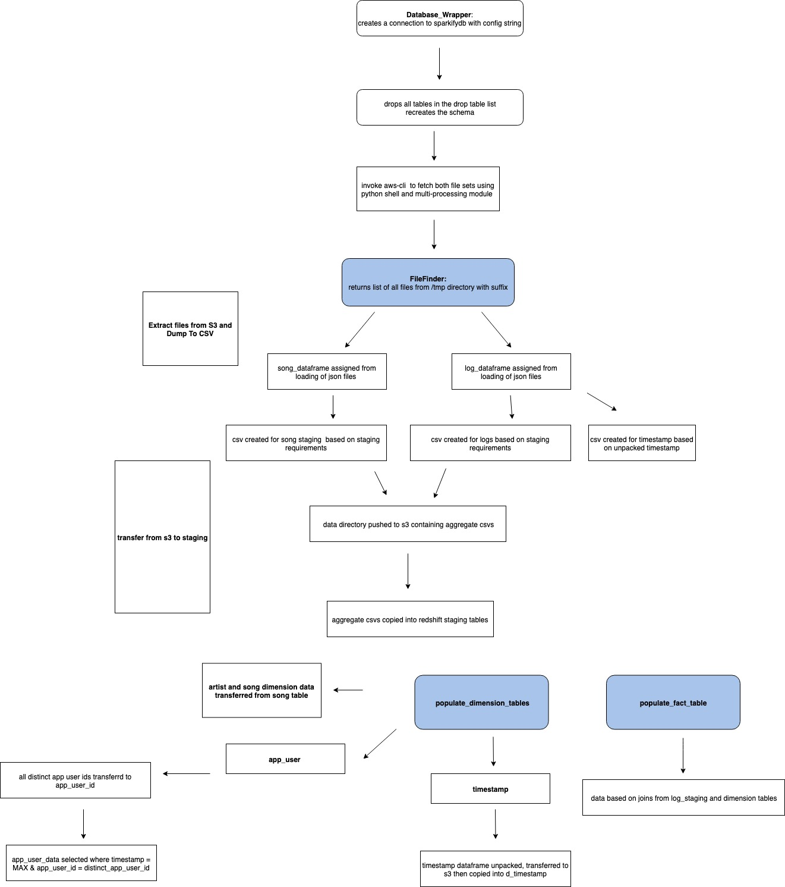
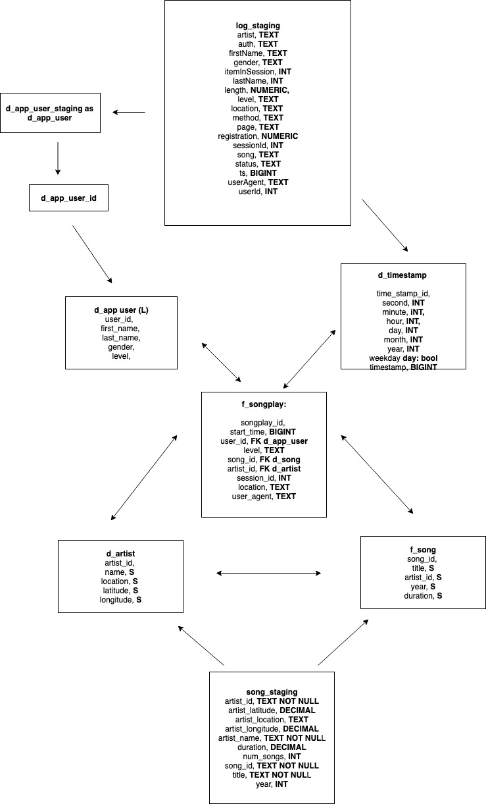

### SPARKIFY ETL 
#### Pipeline to fetch json files from s3, aggregate them and load them into redshfit DB

#### Project Overview

Music company sparkify generate JSON logs that cover how songs are played in their app. This dataset is joined with an open source songs and artist JSON collection so data analysts can identify trends in song plays. 

#### App Architecture

#### Database Schema 

#### Setup

* Create a virtualenv with all the dependencies for the app installed
* Create a configuration file with the following structure

[CLUSTER]
HOST= 

DBNAME=

DB_USER=

DB_PASSWORD=

DB_PORT=

[IAM_ROLE]

IAM_ROLE=

* With the virtualenv loaded run python etl.py. The script takes approximately 11 minutes to run.

#### Caveats With Current Approach

The majority of the songs played by users are missing from the songplay json files. 

As a result joining the songplay table on the song table via the song name produces very few results as the song table does not cover the songs actually played by users. 

To resolve this the following actions could be required:

* Gather an extensive dataset of songs and artists so songs played by users can be joined with this dataset
* Table denormalization. Accept that the song and artist dataset is incomplete and insert the song and artist name directly into the table

Table denormalization would be the easiest and most straightforward approach and would also reduce query complexity as joins would not be required on the artist and song dataset. 

Currently redshift does not support update on conflict in the way that PSQL does. As a result I designed a filter to ensure user first and last names are unique. The filter could be optimized.

Inserting into the fact table could also be optimised as currently a for loop is used from the application to batch load the data. This is by far the part of the application that takes the longest (consuming around 80% of application time). An optimized query where the insert is done from within the DB could be more efficient, and the indexes on the tables need to be reviewed more.

#### Additional Steps

* Performance testing with further denormalized tables, ideally with a bigger dataset or in an environment with low ram to identify bottlenecks
* Have db and python scripts execute inside containers
* Developing unit tests alongside code to make code more production ready and increase documentation
* Review schema optimization and how indexes could be best used to increase speed on the fact table
* Review how to efficiently update on conflict/existing rows and columns

